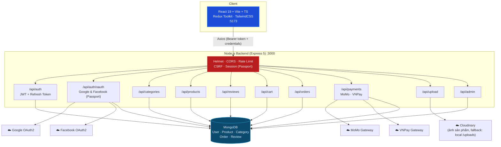

# 🛒 Hypermart — Full-stack E-commerce (MERN)


Hypermart là hệ thống thương mại điện tử full-stack theo mô hình **MERN** (MongoDB, Express, React, Node.js), tập trung vào 3 bài toán thường gặp trong retail thật: **xác thực đa kênh** (email/password + Google/Facebook OAuth2), **thanh toán tự động qua cổng Việt Nam** (MoMo, VNPay với IPN xác nhận giao dịch server-to-server), và **trang quản trị vận hành theo thời gian thực** (quản lý sản phẩm, đơn hàng, người dùng, doanh thu).

> ⚠️ Đây là project cá nhân phục vụ học tập/portfolio. Xem mục [Lưu ý bảo mật](#-lưu-ý-bảo-mật) trước khi deploy production.

---

## 📚 Tài liệu chi tiết

Repo đã có sẵn bộ tài liệu chuyên sâu cho từng mảng — README này chỉ là điểm khởi đầu, nên dùng kèm các file dưới đây:

| Tài liệu | Nội dung |
|---|---|
| **[QUICK_START.md](QUICK_START.md)** ⭐ | Hướng dẫn cài đặt & chạy từng bước, xử lý lỗi thường gặp |
| **[ARCHITECTURE.md](ARCHITECTURE.md)** | Sơ đồ kiến trúc, luồng dữ liệu, cấu trúc thư mục chi tiết |
| **[IMPLEMENTATION_GUIDE.md](IMPLEMENTATION_GUIDE.md)** | Chi tiết implementation: admin, product CRUD, payment |
| **[FEATURES.md](FEATURES.md)** | Danh sách đầy đủ tính năng |
| **[ENV_SETUP.md](ENV_SETUP.md)** · **[OAUTH_SETUP.md](OAUTH_SETUP.md)** | Cấu hình biến môi trường, lấy Google/Facebook API key |
| **[MONGODB_CONNECTION_GUIDE.md](MONGODB_CONNECTION_GUIDE.md)** | Kết nối MongoDB local & Atlas |
| **[docs/API.md](docs/API.md)** | API reference chi tiết |
| **[docs/DB_SCHEMA.md](docs/DB_SCHEMA.md)** | Database schema (Mongoose models) |
| **[docs/VNPAY_SETUP.md](docs/VNPAY_SETUP.md)** | Cấu hình VNPay IPN/return, test bằng ngrok |

---

## ✨ Tính năng chính

- 🔐 **Xác thực đa kênh**: đăng ký/đăng nhập email-password, đăng nhập Google & Facebook (Passport.js OAuth2), `accessToken` JWT ngắn hạn qua header + `refreshToken` xoay vòng (rotation) lưu trong cookie `httpOnly`, quên/đặt lại mật khẩu qua email (Nodemailer).
- 🛡️ **Bảo mật nhiều lớp**: Helmet, CORS whitelist theo origin (hỗ trợ cả pattern wildcard cho preview URL của Vercel), rate limiting, CSRF protection (kiểm tra origin + token rotation), hệ thống khoá tài khoản (ban/unban) ngay trong auth middleware.
- 🛍️ **Catalog & tìm kiếm**: danh mục, danh sách sản phẩm có full-text search, lọc theo giá/rating/danh mục, sắp xếp, phân trang.
- ⭐ **Đánh giá sản phẩm**: user tạo/sửa 1 review mỗi sản phẩm, xoá review của chính mình; admin có quyền xoá review vi phạm.
- 🛒 **Giỏ hàng & Checkout**: giỏ hàng đồng bộ theo tài khoản (lưu trong `User.cart`), tạo đơn hàng kèm địa chỉ giao hàng, chọn phương thức thanh toán.
- 💳 **Thanh toán tự động**: tích hợp **MoMo** và **VNPay** (khởi tạo giao dịch, xử lý IPN/webhook xác nhận thanh toán server-to-server, tra cứu trạng thái đơn), cùng **COD**. (`PAYPAL` có sẵn trong schema nhưng chưa được wiring gateway thật.)
- 🖼️ **Upload ảnh linh hoạt**: tự động dùng **Cloudinary** nếu đã cấu hình biến môi trường; nếu chưa, fallback lưu local vào thư mục `/uploads` — không cần đổi code.
- 👔 **Admin Dashboard**: thống kê doanh thu/đơn hàng/người dùng, quản lý sản phẩm (CRUD + ảnh), quản lý danh mục, cập nhật trạng thái đơn hàng, quản lý người dùng (đổi role, ban/unban, xoá).
- ✅ **Validate chặt chẽ bằng Zod** cho toàn bộ request (body/params/query) ở mọi route.
- 🎉 **UX**: toast notification (`react-hot-toast`), hiệu ứng confetti khi thanh toán thành công, SEO cơ bản qua `react-helmet-async`.

---

## 🏗 Kiến trúc tổng quan



**Luồng auth:**
- `accessToken` (JWT, hạn ngắn) gửi trong header `Authorization: Bearer <token>`.
- `refreshToken` lưu trong cookie `httpOnly`, xoay vòng (rotate) mỗi lần gọi `POST /api/auth/refresh`.
- Đăng nhập Google/Facebook dùng Passport OAuth2 strategy, cần `express-session` để giữ state trong quá trình redirect, sau đó phát hành cùng cặp JWT/refresh token như đăng nhập thường.

---

## 🧰 Tech Stack

| Layer | Công nghệ |
|---|---|
| Backend | Node.js, Express 5, Mongoose 9 (MongoDB) |
| Auth | JWT (`jsonwebtoken`), Passport.js (`passport-google-oauth20`, `passport-facebook`), `bcryptjs` |
| Validation | Zod |
| Bảo mật | Helmet, CORS, `express-rate-limit`, CSRF tự viết (`middlewares/csrf.js`), `express-session` |
| Email | Nodemailer (quên/đặt lại mật khẩu) |
| Media | Cloudinary SDK (kèm fallback lưu local qua Multer) |
| Thanh toán | MoMo API, VNPay (sandbox) |
| Frontend | React 19, TypeScript, Vite 8, TailwindCSS 4 |
| State | Redux Toolkit, React Redux |
| UI/UX | react-hot-toast, react-confetti, react-helmet-async |
| Routing | React Router 7 |
| HTTP client | Axios |
| Deploy-ready | Cấu hình sẵn `vercel.json` cho cả backend & frontend |

---

## 📁 Cấu trúc thư mục (rút gọn)

```
Hypermart/
├── src/                        # Backend (Express)
│   ├── app.js                  # Khởi tạo middleware + mount routes
│   ├── server.js               # Entry point, kết nối MongoDB
│   ├── config/                 # db, passport (Google/Facebook), runtime (CORS/origin)
│   ├── routes/                 # auth, oauth, product, category, cart, order, payment, admin, review, upload
│   ├── controllers/            # Business logic từng route group
│   ├── middlewares/            # auth (JWT + role), csrf, validate (Zod), upload, error
│   ├── models/                 # User, Product, Category, Order, Review (Mongoose)
│   ├── services/                # mediaStorage (Cloudinary/local), momo, vnpay
│   └── utils/
├── scripts/                    # check_order, create_test_order, migrate_images_to_cloudinary, send_vnpay_ipn
├── frontend/                   # React + Vite
│   └── src/
│       ├── pages/               # Home, Products, ProductDetail, Cart, Checkout, Orders, Account, Login/Register, admin/*
│       ├── redux/                # authSlice, cartSlice, productsSlice, store
│       ├── services/             # api.ts (axios instance), payment.ts, admin.ts
│       ├── routes/               # RequireAuth guard
│       └── layouts/              # MainLayout
└── docs/                       # API.md, DB_SCHEMA.md, VNPAY_SETUP.md
```

---

## 🚀 Cài đặt & chạy dự án

### Yêu cầu
- Node.js >= 18
- MongoDB (local hoặc MongoDB Atlas)

### 1. Backend

```bash
git clone https://github.com/tranhoainhan0212/Hypermart.git
cd Hypermart
cp .env.example .env       # rồi điền MONGO_URI, JWT secrets, v.v.
npm install
npm run dev                # chạy bằng nodemon, mặc định http://localhost:3000
```

### 2. Frontend

```bash
cd frontend
cp .env.example .env       # điền VITE_API_BASE_URL nếu backend không chạy ở :3000
npm install
npm run dev                # http://localhost:5173
```

> Cần mở **2 terminal** song song: một cho backend (`npm run dev` ở thư mục gốc), một cho frontend (`npm run dev` trong `frontend/`).

### 3. Kiểm tra nhanh
```http
GET http://localhost:3000/api/health
```
Trả về `{ ok: true, service: "ecommerce-api", allowedOrigins: [...] }` nếu backend chạy đúng.

---

## ⚙️ Biến môi trường quan trọng

Danh sách đầy đủ có sẵn tại [`.env.example`](.env.example) (backend) và [`frontend/.env.example`](frontend/.env.example) — dưới đây là các nhóm chính:

| Nhóm | Biến | Ghi chú |
|---|---|---|
| Core | `NODE_ENV`, `PORT`, `CLIENT_ORIGIN`, `FRONTEND_URL`, `BACKEND_URL` | |
| Database | `MONGO_URI` | Local hoặc MongoDB Atlas |
| JWT | `JWT_ACCESS_SECRET`, `JWT_ACCESS_EXPIRES_IN`, `JWT_REFRESH_SECRET`, `JWT_REFRESH_EXPIRES_IN`, `SESSION_SECRET` | Bắt buộc, phải là chuỗi ngẫu nhiên đủ dài |
| OAuth | `GOOGLE_CLIENT_ID`, `GOOGLE_CLIENT_SECRET`, `FACEBOOK_APP_ID`, `FACEBOOK_APP_SECRET` | Tuỳ chọn — không set thì ẩn luôn nút đăng nhập tương ứng, xem `OAUTH_SETUP.md` |
| Email | `SMTP_HOST`, `SMTP_PORT`, `SMTP_USER`, `SMTP_PASS`, `EMAIL_FROM` | Tuỳ chọn, cần để "quên mật khẩu" gửi được mail |
| MoMo | `MOMO_PARTNER_CODE`, `MOMO_ACCESS_KEY`, `MOMO_SECRET_KEY`, `MOMO_STORE_ID`, `MOMO_WEBHOOK_URL` | Đăng ký tại business.momo.vn |
| VNPay | `VNPAY_TMN_CODE`, `VNPAY_HASH_SECRET`, `VNPAY_PAYMENT_URL` | Xem `docs/VNPAY_SETUP.md` |
| Media | `CLOUDINARY_CLOUD_NAME`, `CLOUDINARY_API_KEY`, `CLOUDINARY_API_SECRET`, `CLOUDINARY_FOLDER` | Để trống → tự fallback lưu local |
| Bảo mật nâng cao | `ALLOWED_WEBHOOK_PATHS`, `ALLOWED_ORIGIN_PATTERNS`, `DISABLE_CSRF` | Dùng cho môi trường deploy (VD wildcard `*.vercel.app`) |
| Frontend | `VITE_API_BASE_URL` | Trỏ về URL backend |

---

## 📡 API tổng quan

Toàn bộ endpoint có prefix `/api`. Chi tiết đầy đủ tham số/response xem [`docs/API.md`](docs/API.md); tóm tắt nhóm chính:

| Nhóm | Method & Path | Auth |
|---|---|---|
| Auth | `POST /auth/register`, `/login`, `/refresh`, `/logout`, `/forgot-password`, `/reset-password`, `GET /me`, `PUT /me` | Một số cần login |
| OAuth | `GET /auth/oauth/google`, `/auth/oauth/facebook` (+ `/callback`) | Public (redirect flow) |
| Products | `GET /products`, `GET /products/:idOrSlug`, `POST/PUT/DELETE /products/:id` | Ghi cần `admin` |
| Categories | `GET /categories`, `POST/PUT/DELETE /categories/:id` | Ghi cần `admin` |
| Reviews | `GET /reviews`, `POST /reviews/me`, `DELETE /reviews/me/:id`, `DELETE /reviews/:id` (admin) | Ghi cần login |
| Cart | `GET/PUT/DELETE /cart/me` | Cần login |
| Orders | `POST /orders`, `GET /orders/me`, `GET /orders/me/:id`, `GET /orders` (admin), `PUT /orders/:id/status` (admin) | Cần login/admin |
| Payments | `POST /payments/momo/initiate`, `POST /payments/momo/webhook`, `POST /payments/vnpay/initiate`, `GET /payments/vnpay/return`, `POST|GET /payments/vnpay/ipn`, `GET /payments/:orderId/status` | Webhook/IPN không cần auth |
| Upload | `POST /upload/image` | Cần `admin` |
| Admin | `GET /admin/dashboard`, `GET /admin/users`, `PUT /admin/users/:id/ban|unban|role`, `DELETE /admin/users/:id` | Cần `admin` |
| Health | `GET /health` | Public |

---

## 🧪 Scripts hữu ích

```bash
npm run test:vnpay-ipn        # scripts/send_vnpay_ipn.js — giả lập VNPay IPN gọi về server local
npm run migrate:cloudinary    # scripts/migrate_images_to_cloudinary.js — chuyển ảnh /uploads cũ lên Cloudinary
```
Ngoài ra còn `scripts/check_order.js` và `scripts/create_test_order.js` hỗ trợ debug/test đơn hàng trực tiếp qua DB.

---

## 🔒 Lưu ý bảo mật

- **`mongoSanitize()` và `xss-clean()` hiện đang bị comment out** trong `src/app.js` (dòng khai báo middleware chống NoSQL injection/XSS payload đã tồn tại nhưng không được `app.use()`). Nếu muốn bật lại lớp bảo vệ này, uncomment 2 dòng tương ứng — nên bật trước khi deploy thật, vì hiện tại request body chưa được sanitize ở tầng middleware.
- CSRF hiện bảo vệ bằng kiểm tra `Origin`/token rotation qua `middlewares/csrf.js`; biến `DISABLE_CSRF` chỉ nên dùng khi debug local, **không set `true` ở production**.
- `SESSION_SECRET`, `JWT_ACCESS_SECRET`, `JWT_REFRESH_SECRET` phải là chuỗi ngẫu nhiên đủ mạnh và **không commit vào git** — file `.env.example` chỉ chứa placeholder, giá trị thật nằm trong `.env` (đã có trong `.gitignore`).
- Webhook MoMo/VNPay (`/api/payments/momo/webhook`, `/api/payments/vnpay/ipn`) cố tình không yêu cầu auth/CSRF vì được gọi server-to-server từ cổng thanh toán — đảm bảo có xác minh chữ ký (`vnp_SecureHash`, MoMo signature) trong controller trước khi tin dữ liệu từ các endpoint này.

---

## 📄 License

Phát hành theo giấy phép [MIT](LICENSE).
